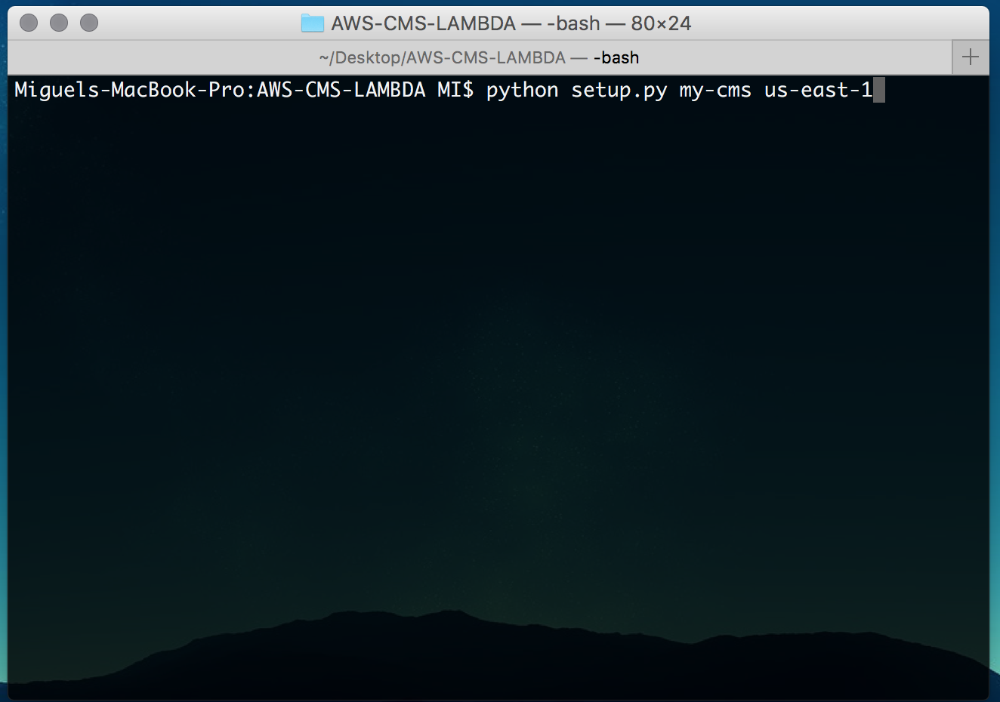
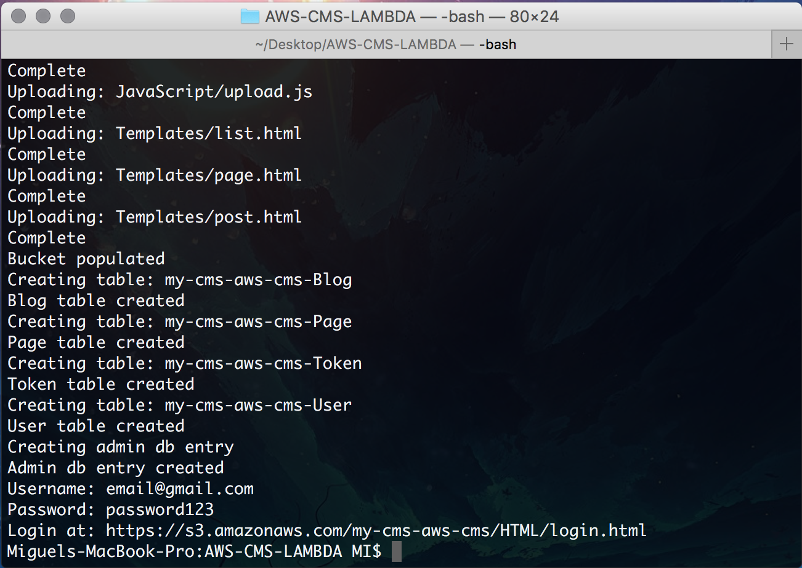
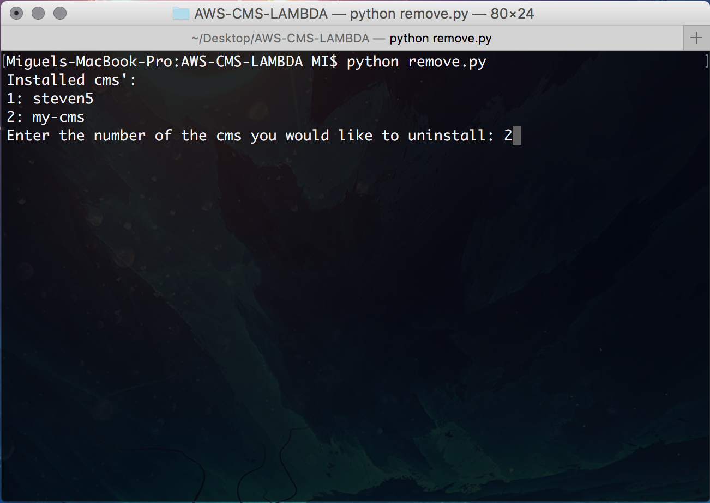
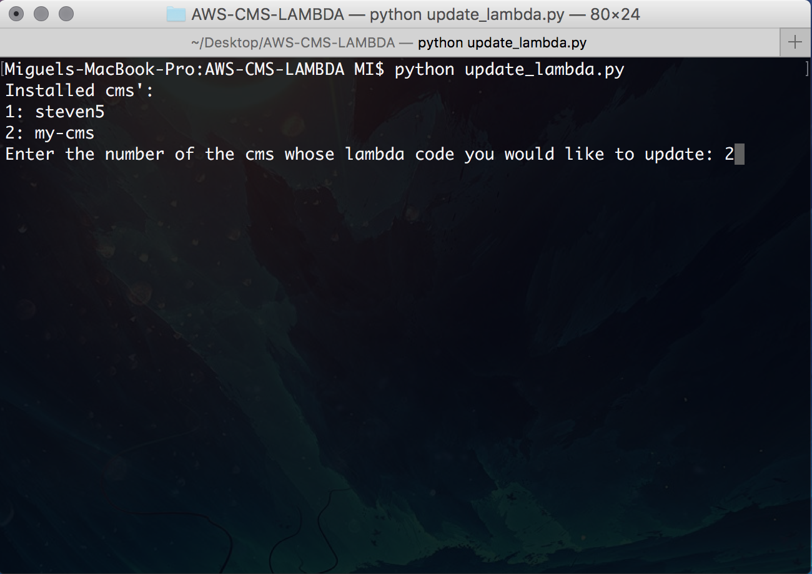

#Installation
<hr>

## First Download code
Download the [Repo code here](https://github.com/Kitsui/AWS-CMS-LAMBDA)

## Set up your Environment
1. Open up your terminal and navigate to the **CMS Repo** directory's root.

2. Ensure that your AWS terminal has already been configured with the right credentials for the account you wish to deploy to.

## CMS management information
The Removal and update of each CMS relies on the constants.json file to keep records of the istalled CMS, hence this means that 
the removal/update-lambda scripts only can remove/update the existing resources with that file being present in the root directory. 
The setup can support many CMS installations on one AWS account however this will exceed the free tier on the platform.  

##Perform setup steps
1. To deploy, run the following command in your terminal window  
**CMS-Name :** name for your CMS  
**AWS-Region (Optional):** AWS Region the CMS is be installed on.  
** Note : A Region with the Lambda module avilable will have to be selected **   
**Find** the up to date available services by region [**here**](https://aws.amazon.com/about-aws/global-infrastructure/regional-product-services/) 
```Python
python setup.py CMS-Name AWS-Region
```

#### Installation Success Check
After the Setup script has finished its work, navigate to [Amazon Web Services](aws.amazon.com) and login to verify your installation was successful.  
You should be able to see new resources within the **S3 bucket**, **Dynamo Database**, **API gateway** and **Lambda** with the same CMS-Name suffixed 
to the resource name.
#### Admin Login Credentials
You will be given a default **Password** and **Username** to login to the **Admin panel** at the end of the setup as seen bellow.


##Setting Up CloudFront
Next you would want to set up your Cloud Front from the AWS Console.
<br />
<hr>

#Removal
##Perform removal steps

3. To Remove, run the following command in your terminal window.

```Python
python remove.py
```
You will be prompted with a list of installed CMS with a corresponding Number, type the **Number** of the CMS you wish to **Remove** and hit **Enter**.


<br />
<hr>

#Updating Lambda Package

##Information
The following instructions is for deploying the **Lambda** package after modifying or adding functionality for  
more information about developing on **Lambda** click [here](https://github.com/Kitsui/AWS-CMS-LAMBDA/wiki)

##Perform update steps

3. To Update, run the following command in your terminal window.

```Python
python update.py
```
You will be prompted with a list of installed CMS with a corresponding Number, type the **Number** of the CMS you wish to **Update** and hit **Enter**.

  

###Everything Looks pretty good so far!  
**Lets set up the settings of your personalised site!**  
[Site Settings Setup >>](site-settings.md)