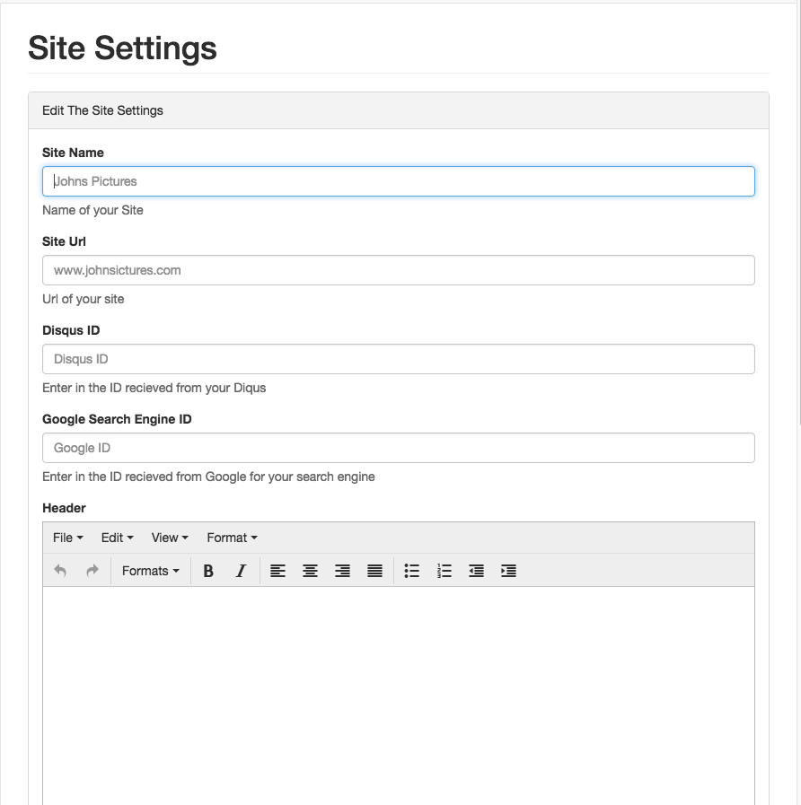

#Site Settings  

This is the section of the dashboard that controls the core configuration of 
features that will be constant through out your whole site.  

##Site URL
If you go to your site right now, notice that when you look at the current URL address
of your site is not quite attractive. This setting allows you to set the site URL/Domain 
name you wish your site to be reached at. This would typically be linked up through your CDN
with th a domain you own.

##Google Search URL & Disqus URL
Will be added soon.

##Header
This Section allows you to customize the header of your site

##Footer
This Section allows you to customize the footer of your site

 
### Nice Structure!
**Now Lets add some content!**  
[<< Installation](installation.md) | [Managing Your Content >>](../Managing Content.md)  
 
 